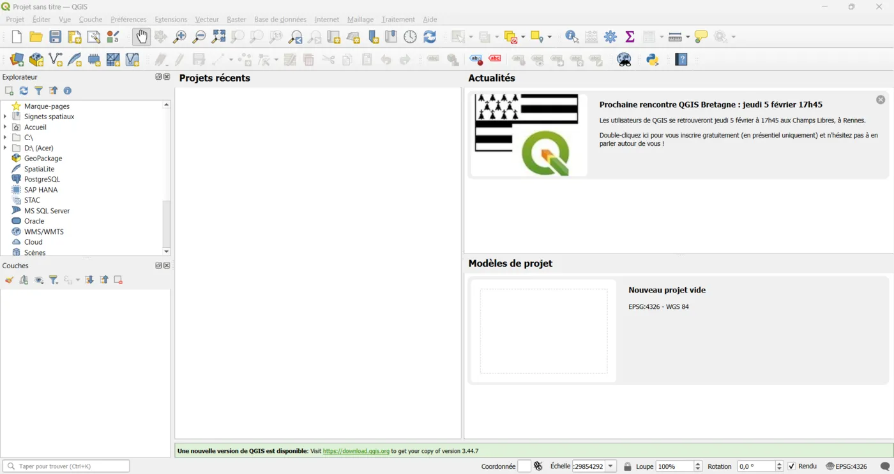
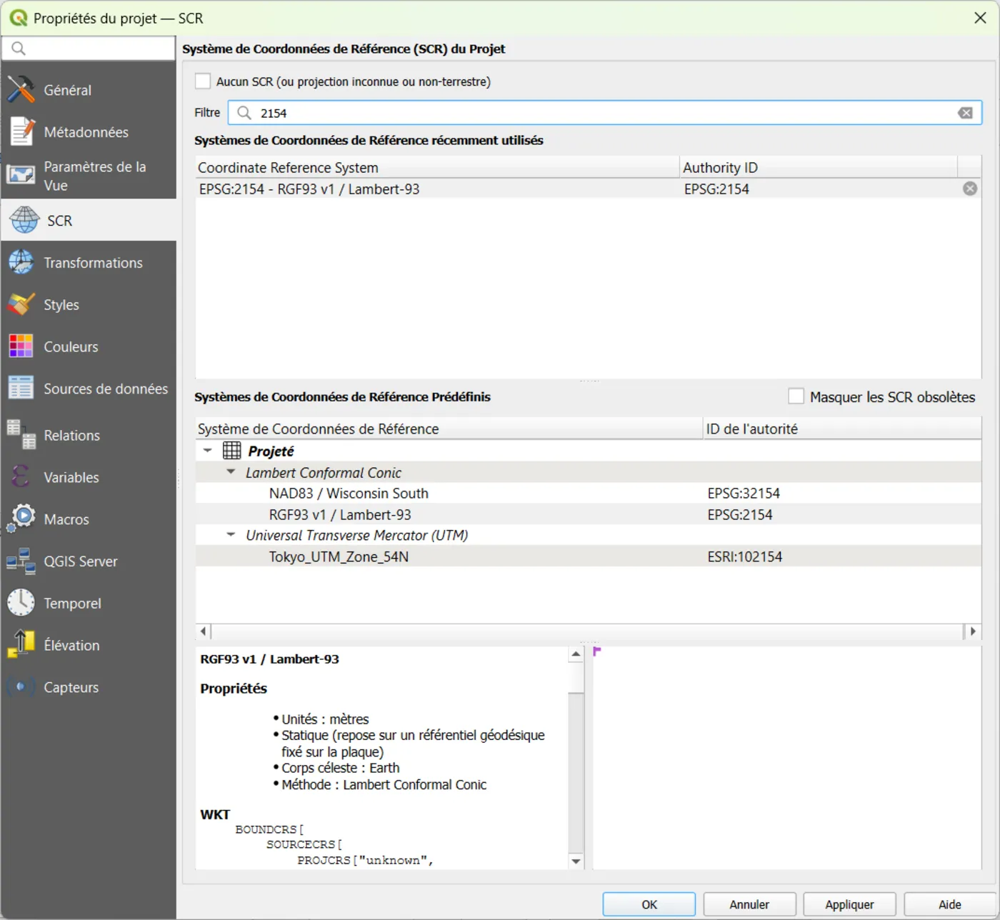
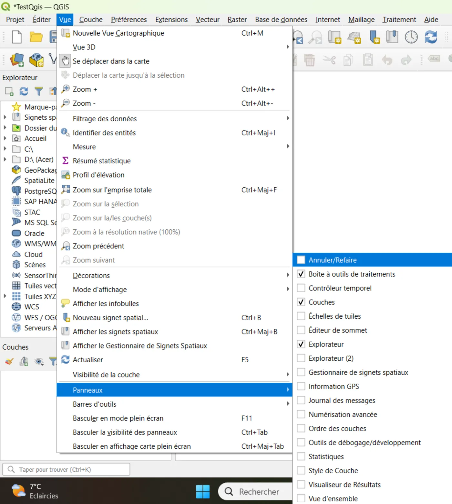
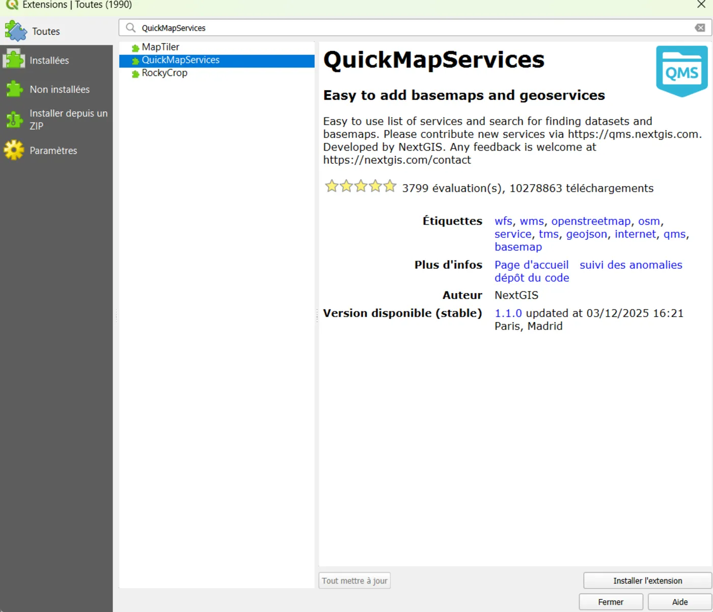

# 01 — Installer QGIS et régler le projet (indispensable)

## Objectif
Avoir un QGIS prêt à produire

## Résultat attendu
- QGIS installé
- Un projet QGIS enregistré
- Le CRS du projet est clair et cohérent

---

## Étapes (clic par clic)

### A) Installer QGIS
1. Télécharge et installe QGIS (version 3.x, idéalement LTR).
2. Lance QGIS.

📸 capture : fenêtre de lancement Qgis.

### B) Créer et enregistrer un projet
1. Menu **Projet** → **Nouveau**
2. Menu **Projet** → **Enregistrer sous…**
3. Crée un dossier de travail (ex : `C:\...\qgis-guide-pratique\exemples\`)
4. Enregistre : `projet_exemple.qgz`

### C) Vérifier le CRS du projet (en bas à droite)
1. En bas à droite, repère le code CRS (ex : `EPSG:4326`)
2. Clique dessus
3. Choisis un CRS adapté à ton travail :
   - Données France : souvent `EPSG:2154` (Lambert-93) pour mesures en mètres
   - Données web : souvent `EPSG:4326` (WGS84) ou `EPSG:3857` (Web Mercator)

> Règle simple : si tu mesures (distance/surface), préfère une projection métrique (souvent 2154 en France).

📸 capture : fenêtre de choix CRS Qgis.

### D) Activer l’affichage utile
1. Menu **Vue** → **Panneaux**
2. Active :
   - **Panneau Couches**
   - **Panneau Explorateur**
   - **Boîte à outils Traitements** 

📸 capture : fenêtre de choix Vues Qgis.

### E) (Optionnel) Plugins utiles
1. Menu **Extensions** → **Installer/Gérer les extensions**
2. Rechercher puis installer :
   - **QuickMapServices** (fonds de carte)
   - **QuickOSM** (extraire des données OpenStreetMap)

> Ne surcharge pas : 1–2 plugins suffisent pour démarrer.

---
📸 capture : fenêtre de choix Plugins Qgis.

## Erreurs fréquentes
- “Je ne vois pas le CRS” → regarde en bas à droite, ou **Projet → Propriétés → CRS**
- “Mes surfaces sont absurdes” → tu es probablement en CRS degrés (4326), pas en mètres (2154)

## Mini-exercice
- Crée un projet et règle le CRS en Lambert 93 `EPSG:2154`

