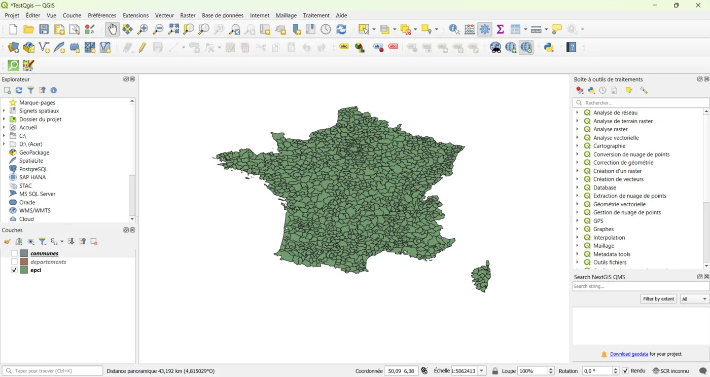
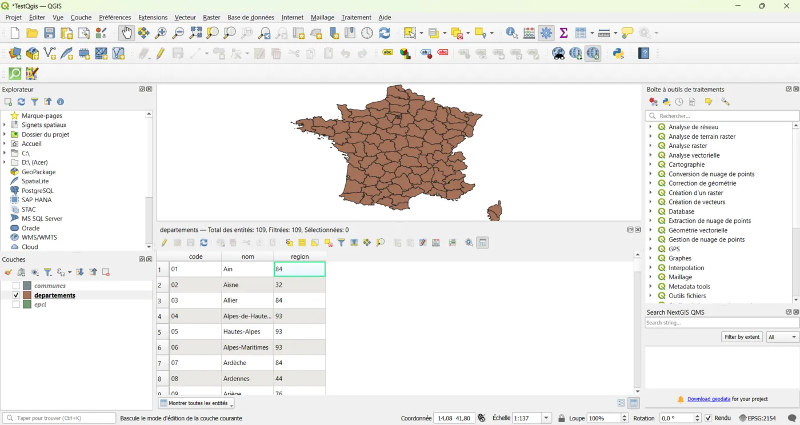
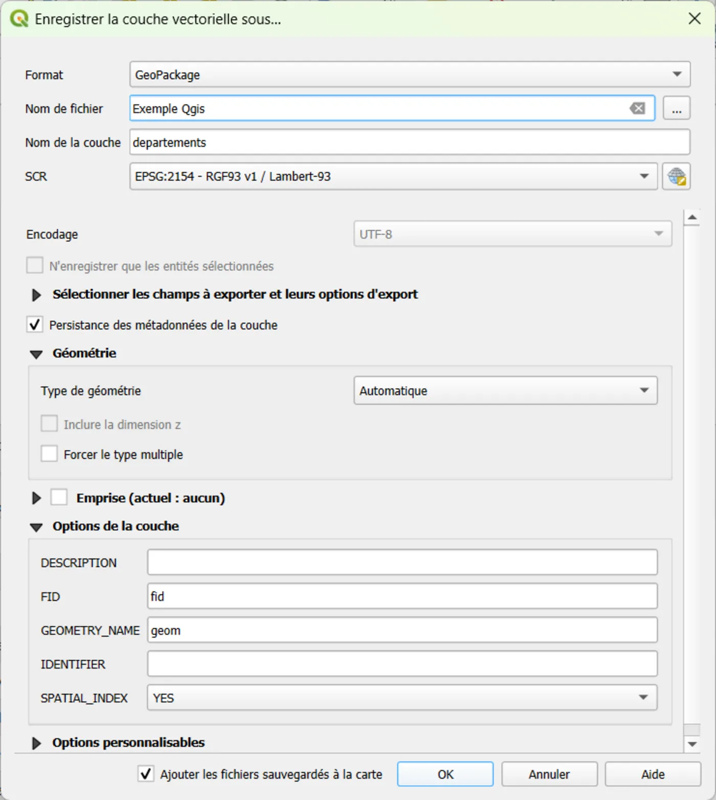

# 02 — Importer des données et vérifier le CRS

## Objectif
Importer une couche vecteur dans QGIS et vérifier immédiatement si le CRS est correct.

## Résultat attendu
- La couche est visible dans la carte
- Tu connais le CRS de la couche et du projet
- Tu sais exporter proprement en GeoPackage

---

## Étapes (clic par clic)

### A) Ajouter une couche vecteur
1. Menu **Couche** → **Ajouter une couche** → **Ajouter une couche vecteur…**
2. Source : **Fichier**
3. **Parcourir…** → sélectionne ton fichier (`.gpkg`, `.geojson`, `.shp`)
4. Clique **Ajouter**
5. Clique **Fermer**

📸 capture : couche importée.

### B) Vérifier le CRS de la couche
1. Dans le panneau **Couches** : clic droit sur la couche → **Propriétés**
2. Onglet **Information**
3. Repère :
   - **CRS**
   - **Étendue** (bbox)
4. Ferme

📸 capture : CRS de la couche.

### C) Vérifier le CRS du projet
1. Regarde en bas à droite (CRS projet)
2. Si besoin : clique et choisis un CRS adapté

### D) Vérifier rapidement les attributs
1. Clic droit sur la couche → **Ouvrir la table d’attributs**
2. Vérifie :
   - nom des champs (colonne “id”, “code”…)
   - valeurs vides évidentes
3. Ferme

📸 capture : Table d'attributs.

### E) Exporter en GeoPackage (propre)
1. Clic droit sur la couche → **Exporter** → **Sauvegarder les entités sous…**
2. Format : **GeoPackage**
3. Fichier : choisis `exemples\donnees.gpkg`
4. Nom de couche : `communes` (ou autre)
5. CRS : choisis le CRS cible (ex : `EPSG:2154`)
6. Clique **OK**

---

📸 capture : Exportation GeoPackage.

## Erreurs fréquentes
- “Ma couche s’affiche loin / pas au bon endroit” :
  - CRS de la couche incorrect / mal défini
  - ou CRS projet différent
- “Je ne peux pas mesurer correctement” :
  - tu n’es pas en projection métrique (ex : `EPSG:2154`)

## Mini-exercice
- Importe un GeoJSON
- Vérifie le CRS couche + CRS projet
- Exporte en GeoPackage en `EPSG:2154`

