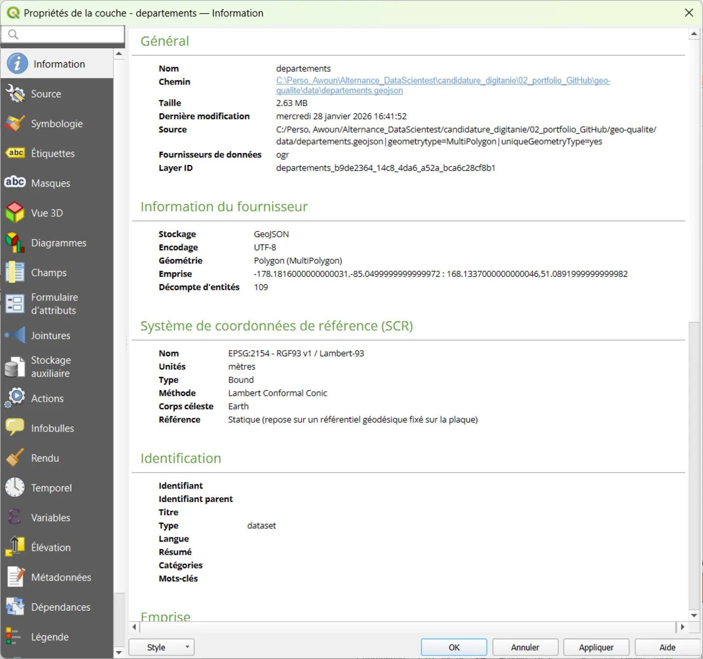
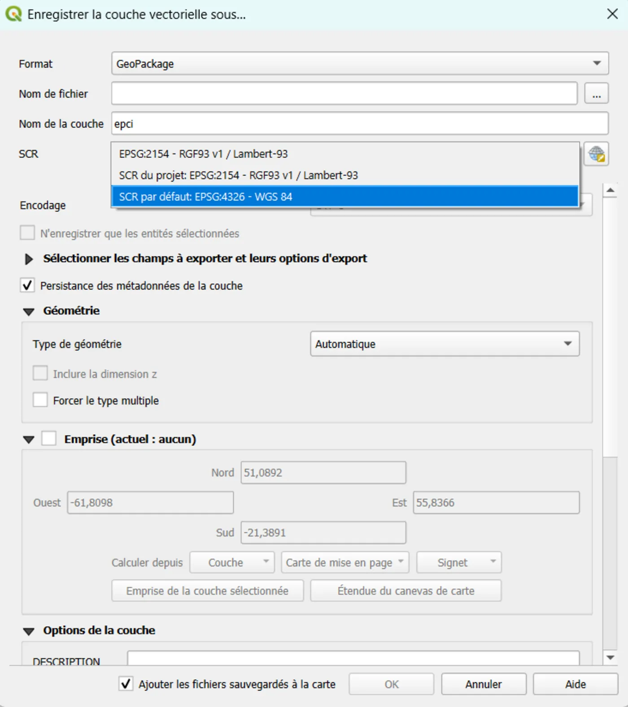

# 03 — Reprojection (CRS) : comprendre et convertir proprement

## Objectif
Comprendre la différence entre :
- **CRS de la couche**
- **CRS du projet**
- **Reprojection à la volée** (affichage)
- **Reprojection réelle** (conversion de données)

Et savoir **convertir** une couche dans un CRS cible (ex : EPSG:2154) en exportant proprement.

## Résultat attendu
- Tu sais identifier le CRS d’une couche
- Tu sais choisir un CRS cible adapté
- Tu sais **reprojeter vraiment** une couche via export GeoPackage

---

## Notions indispensables (simple)
- QGIS peut afficher des couches de CRS différents ensemble (**reprojection à la volée**).
- Mais pour les **mesures** (surface/distance) et pour une **livraison**, on préfère souvent que les données soient dans un CRS adapté (ex : EPSG:2154 en France métro).

---

## Étapes (clic par clic)

### A) Vérifier le CRS de la couche (source)
1. Clic droit sur la couche → **Propriétés**
2. Onglet **Information**
3. Note le **CRS** (ex : EPSG:4326)

📸 Capture recommandée : Propriétés → Information (CRS visible).

---

### B) Vérifier le CRS du projet (affichage)
1. Regarde le CRS en **bas à droite** dans QGIS
2. Clique dessus si besoin pour le changer

📸 Capture recommandée : coin bas droit avec le CRS projet visible.

---

### C) Choisir le CRS cible (règle débutant)
- Si ton objectif = **mesurer** (surface/distance) en France métropolitaine : **EPSG:2154 (Lambert-93)**
- Si ton objectif = **web / fonds de carte** : souvent **EPSG:4326** ou **EPSG:3857** (mais pas pour mesurer)

> ⚠️ Attention (France + Outre-mer)
> EPSG:2154 (Lambert-93) est surtout adapté à la métropole.
> Si ta couche contient aussi l’Outre-mer, reprojeter toute la couche en 2154 peut produire :
> - des coordonnées très grandes (dizaines/centaines de millions de mètres),
> - et parfois un CRS affiché comme `unknown` (définition “bound”/équivalente).
> Recommandation :
> - garder la couche complète en EPSG:4326 (WGS84) et laisser QGIS reprojeter à la volée,
> - ou filtrer la métropole avant de reprojeter en EPSG:2154.

---

### D) Reprojeter vraiment la couche (export)
1. Clic droit sur la couche → **Exporter** → **Sauvegarder les entités sous…**
2. Format : **GeoPackage**
3. Fichier : choisis (ex : `exemples/donnees.gpkg`)
4. Nom de couche : donne un nom explicite (ex : `communes_2154`)
5. CRS : clique sur le CRS et choisis **EPSG:2154**
6. Clique **OK**
7. QGIS ajoute souvent la nouvelle couche : vérifie qu’elle apparaît

📸 Capture recommandée : fenêtre “Sauvegarder les entités sous…” avec CRS cible visible (EPSG:2154).

---

### E) Vérifier que la reprojection est OK
1. Clic droit sur la nouvelle couche (`..._2154`) → **Propriétés** → **Information**
2. Vérifie que le CRS est bien **EPSG:2154**

## Erreurs fréquentes (et solutions)
- “Je change le CRS du projet mais mon fichier n’est pas converti”
  → normal : ça change surtout l’affichage (reprojection à la volée).  
  Pour convertir : **Exporter → Sauvegarder les entités sous…**
- “Ma couche est au mauvais endroit”
  → CRS source mal défini : vérifier Propriétés → Information (si CRS incohérent, il faut corriger le CRS attribué avant de reprojeter)

---

## Mini-exercice
- Prends une couche en EPSG:4326 (si tu en as une)
- Exporte-la en GeoPackage en EPSG:2154 avec un nom `*_2154`
- Vérifie le CRS de la couche exportée dans Propriétés → Information
