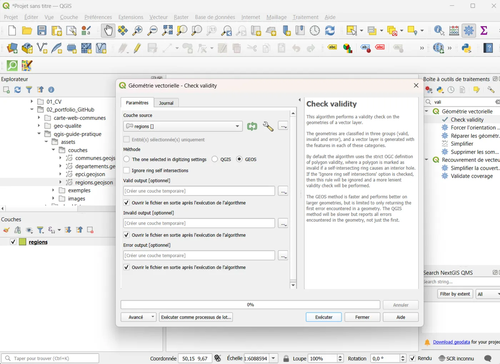
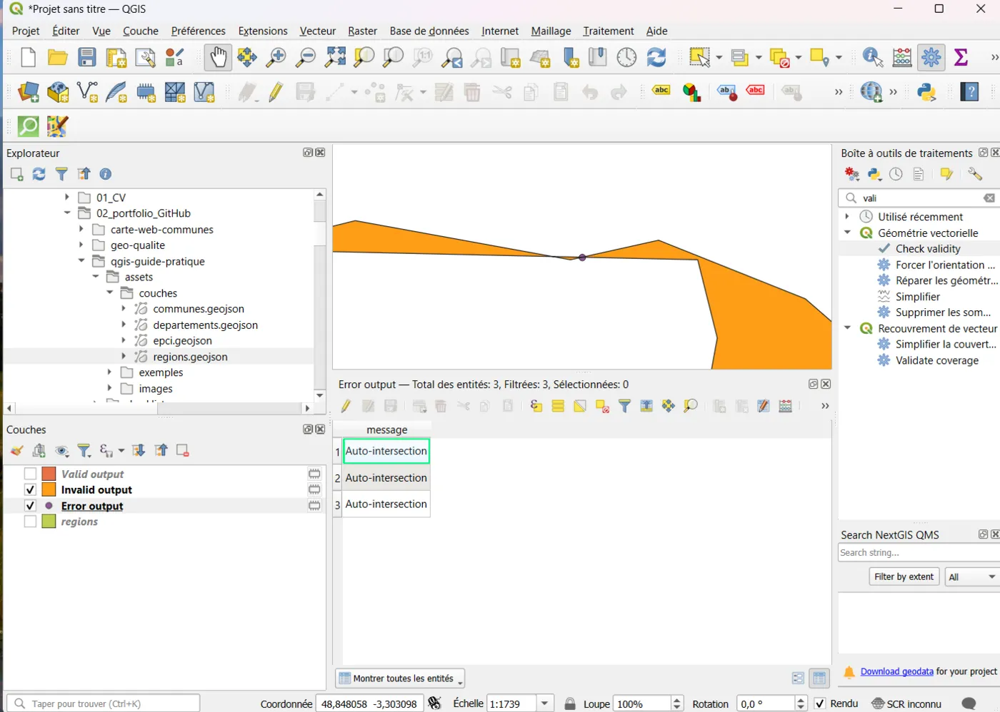
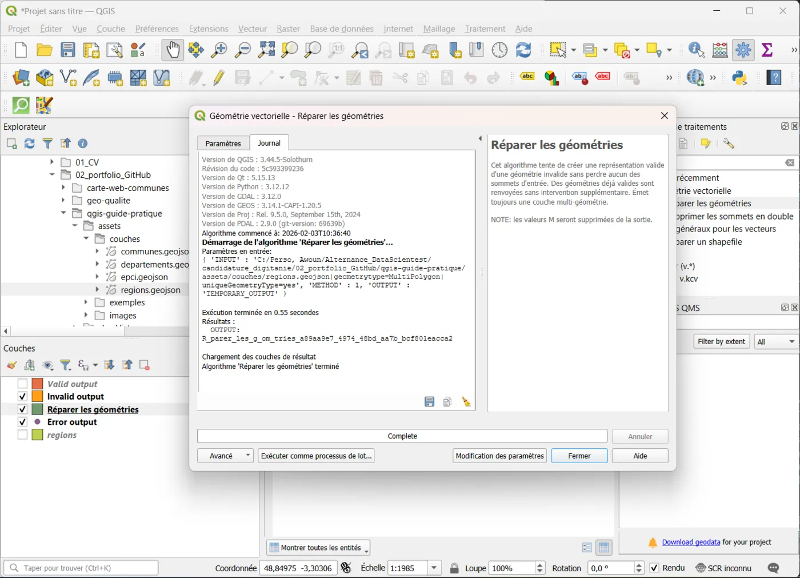
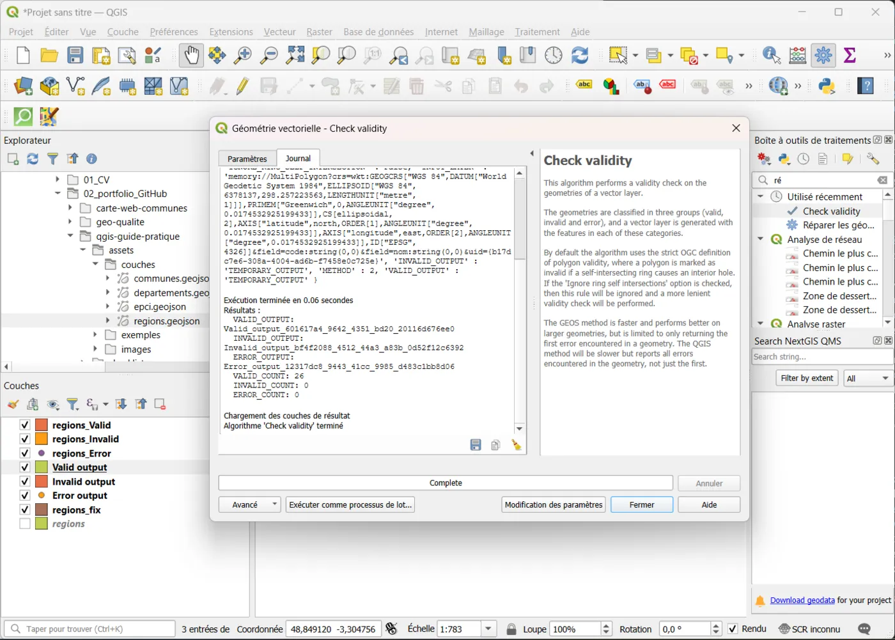
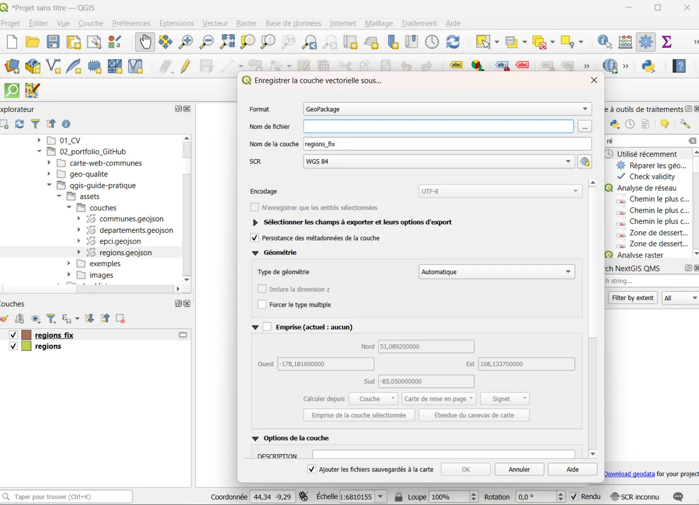

# 04 — Contrôle géométrie : détecter et corriger les erreurs

## Objectif
Vérifier si les géométries d’une couche sont valides (polygones/lines/points) et corriger les erreurs courantes avant livraison.

## Résultat attendu
- Tu sais lancer une vérification de validité
- Tu sais localiser les erreurs sur la carte
- Tu sais produire une couche “corrigée” via un outil standard
- Tu sais exporter la couche corrigée en GeoPackage

---

## Avant de commencer (important)
- Travaille sur une **copie** (ou export) de la couche, pas sur l’unique fichier d’origine.
- Si la couche est très lourde, commence par tester sur un petit échantillon (facultatif).

---

## Étapes (clic par clic)

### A) Vérifier la validité des géométries
1. Ouvre la **Boîte à outils Traitements** (Processing) Menu **Traitement**→ **Boîte à outils**
2. Dans la recherche, tape : **Vérifier la validité**  
   (anglais possible : **Check validity**)
3. Outil : **Vérifier la validité** (QGIS) ou **GEOS : Vérifier la validité** (selon version)
4. Couche en entrée : sélectionne ta couche (ex : `regions`, `regions_metropole_2154`, etc.)
5. Lance l’outil (**Exécuter**)

📸 Capture : fenêtre de l’outil “Vérifier la validité” avec la couche sélectionnée.

---

### B) Comprendre les sorties de “Vérifier la validité”
Selon l’outil/version, QGIS peut produire :
- une couche “**Géométries valides**”/“**Valid output**”
- une couche “**Géométries invalides**”/“**Invalid output**”
- et/ou une couche “**Erreurs**”/“**Error output**” (points d’erreur + type d’erreur)

1. Dans le panneau **Couches**, repère les nouvelles couches générées
2. Affiche la couche des **invalides** et/ou des **erreurs**
3. Clique sur une erreur pour voir son type (infobulle/attributs)

📸 Capture : la couche des erreurs/invalides visible (liste + carte).

---

### C) Localiser rapidement une erreur (zoom)
1. Ouvre la table d’attributs de la couche **Erreurs** (si elle existe)
2. Clique sur une ligne d’erreur
3. Clique **Zoomer sur l’entité sélectionnée** (icône loupe)
4. Observe la zone sur la carte

📸 Capture : une erreur sélectionnée + zoom sur la zone.

---

## Corriger : méthode standard “Fix geometries”

### D) Corriger les géométries
1. Boîte à outils Traitements
2. Cherche : **Réparer les géométries**  
   (anglais : **Fix geometries**)
3. Couche en entrée : ta couche d’origine (ex : `regions`)
4. Dans “Réparer les géométries”, clique sur `…` (sortie) et choisis :
   - “Créer une couche temporaire”, ou
   - “Enregistrer dans un fichier…” avec une extension `.gpkg`

5. Exécute

📸 Capture : fenêtre “Corriger les géométries” avec la couche en entrée + sortie.

---

### E) Vérifier que la correction a marché
1. Relance **Vérifier la validité** sur la couche corrigée (`*_fix`)
2. Compare :
   - nombre d’invalides avant
   - nombre d’invalides après
3. Idéalement : 0 invalide (ou beaucoup moins)

📸 Capture : résultat “après correction” montrant 0 d’invalides.

---

### F) Exporter la couche corrigée (livrable)
1. Clic droit sur la couche corrigée (`*_fix`) → **Exporter**
2. **Sauvegarder les entités sous…**
3. Format : **GeoPackage**
4. Nom de fichier : `livraison/donnees_corrigees.gpkg` (exemple)
5. Nom de couche : explicite (ex : `regions_fix`)
6. CRS : laisse celui de la couche (sauf raison particulière)
7. OK

📸 Capture : fenêtre d’export GeoPackage (nom couche + CRS visibles).

---

## À savoir (pédagogique)
- Certaines erreurs proviennent de données sources : on peut corriger, mais il est utile de le noter en métadonnées.
- “Corriger les géométries” règle souvent la majorité des cas (self-intersections, anneaux…).
- Si tu observes des différences visuelles (petites déformations), c’est normal : la correction reconstruit une géométrie valide.

---

## Erreurs fréquentes
- “Je n’ai pas de couche ‘Erreurs’ en sortie”
  → selon la version, les sorties changent. L’important est d’identifier la couche des invalides (ou de valider que tout est OK).
- “Après correction, il reste des invalides”
  → parfois certaines géométries sont complexes. On peut tenter :
    - corriger une seconde fois,
    - ou simplifier (avancé),
    - ou isoler les entités problématiques.

---

## Mini-exercice
- Lance “Vérifier la validité” sur une couche administrative (communes/départements)
- Corrige avec “Corriger les géométries”
- Vérifie à nouveau

