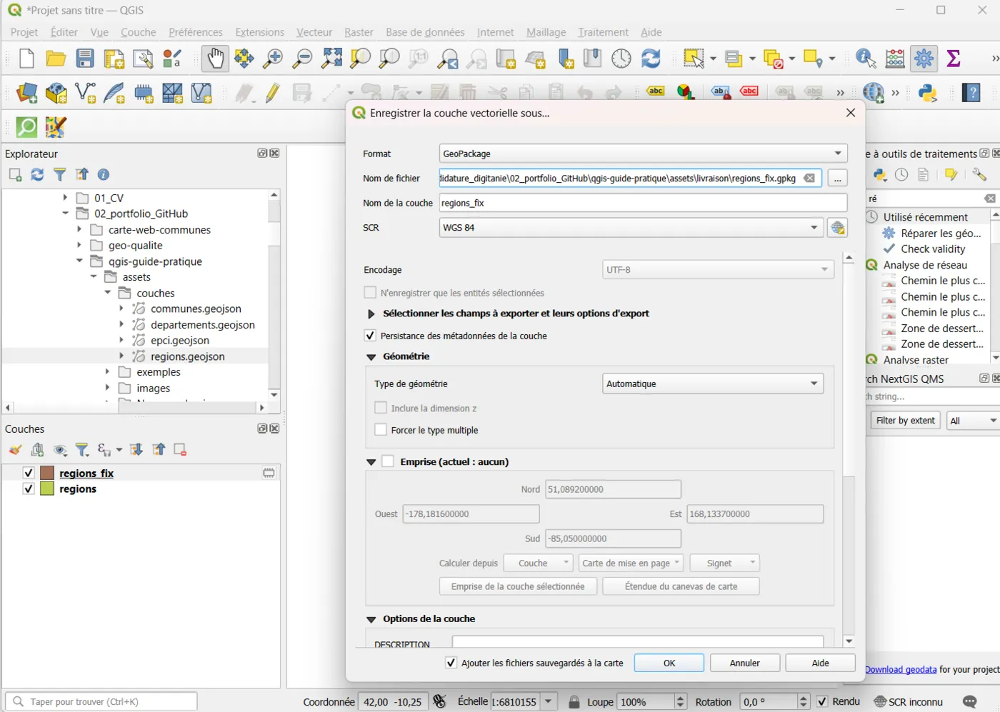
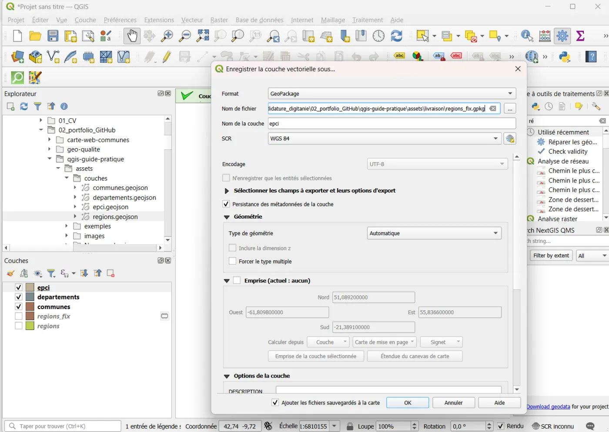
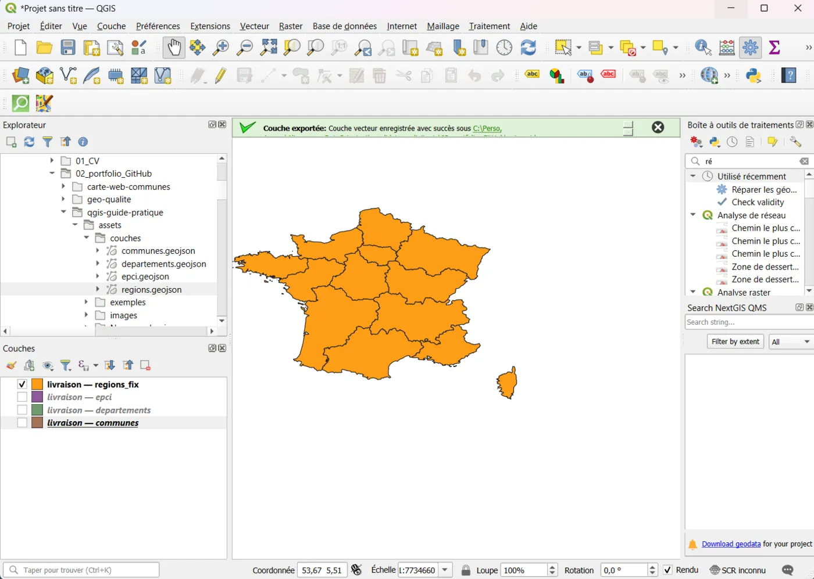
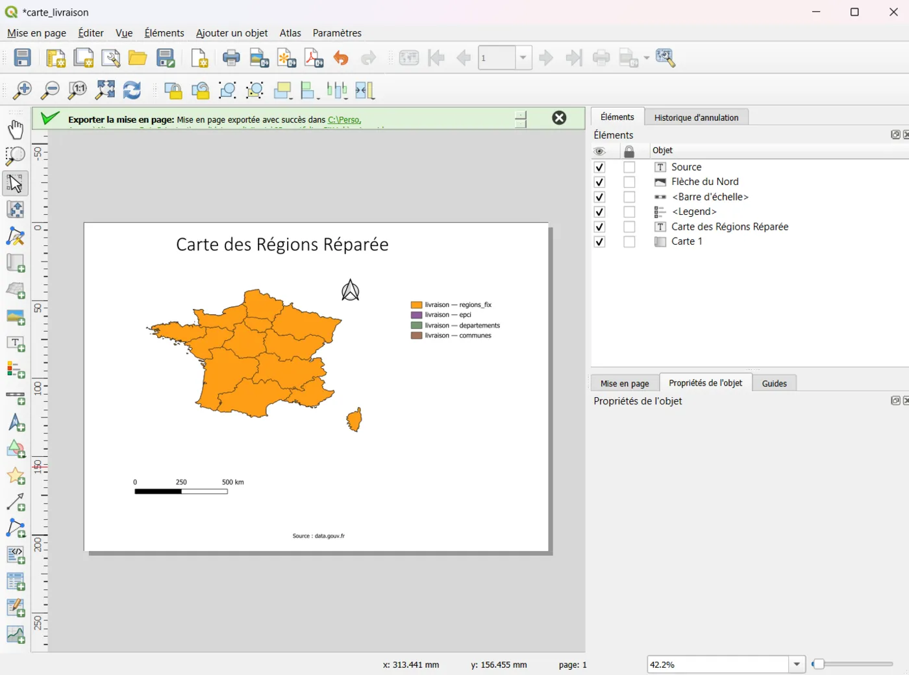
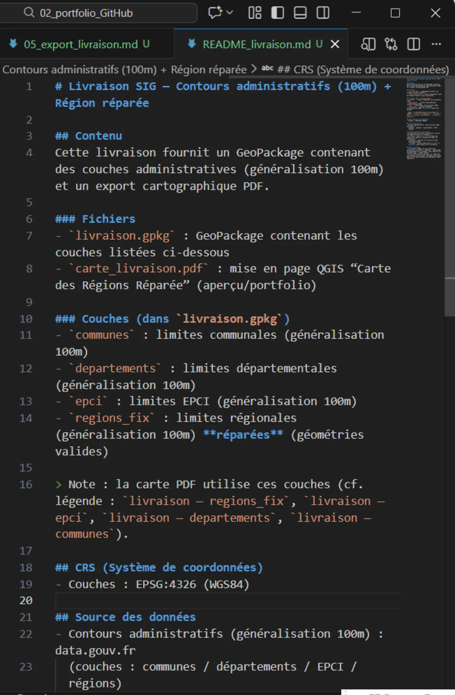

# 05 — Export & Livraison : produire un livrable propre (GeoPackage + mini README)

## Objectif
Créer une livraison lisible et réutilisable :
- données exportées au bon format (GeoPackage)
- noms de couches clairs
- dossier de livraison propre
- mini README pour expliquer le contenu

## Résultat attendu
- Un dossier `livraison/` contenant :
  - `livraison.gpkg` (1 fichier principal)
  - `README_livraison.md` (2–10 lignes claires)
  - (optionnel) `projet.qgz` si tu veux fournir un projet QGIS prêt à ouvrir

---

## Préparation (recommandé)
1. Crée un dossier `livraison/` à la racine de ton projet (si pas déjà fait)
2. Assure-toi d’avoir une couche "finale" (ex : `regions_fix`, `communes_2154_fix`, etc.)

## Étapes (clic par clic)

### A) Exporter une couche finale en GeoPackage
1. Dans le panneau **Couches**, clic droit sur la couche finale (ex : `regions_fix`)
2. **Exporter** → **Sauvegarder les entités sous…**
3. Paramètres recommandés :
   - **Format** : GeoPackage
   - **Nom du fichier** : `livraison/livraison.gpkg`
   - **Nom de couche** : explicite (ex : `regions`)
   - **SCR/CRS** : laisse celui de la couche (sauf raison particulière)
4. Clique **OK**

📸 Capture : fenêtre “Sauvegarder les entités sous…” (Format=GeoPackage + nom de couche).


---

### B) Ajouter plusieurs couches dans le même GeoPackage (si besoin)
Si tu as plusieurs couches (ex : communes + départements + régions) :
1. Exporter chaque couche en GeoPackage **dans le même fichier** `livraison/livraison.gpkg`
2. À chaque export, choisis un **Nom de couche différent** :
   - `communes`
   - `departements`
   - `regions`
   - `epci`

📸 Capture : fenêtre d’export montrant un nom de couche différent (ex : `communes` puis `regions`).


---

### C) Vérifier le GeoPackage livré (test de réouverture)
1. Dans QGIS : **Couche** → **Ajouter une couche** → **Ajouter une couche vecteur…**
2. Sélectionne `livraison/livraison.gpkg`
3. Choisis une couche (ex : `regions`) → **Ajouter**
4. Vérifie :
   - la couche s’affiche correctement
   - le CRS est cohérent
   - la table d’attributs est OK

📸 Capture : ajout de `livraison.gpkg` (sélection de la couche à importer).


---

### D) (Optionnel) Créer une mise en page simple (export carte)
Si tu veux montrer une carte “portfolio” :
1. Menu **Projet** → **Nouvelle mise en page…**
2. Donne un nom : `carte_livraison`
3. Dans la mise en page :
   - **Ajouter un objet**/**Ajouter une carte** (rectangle sur la page)
   - Ajouter :
     - **Ajouter un objet**/**Ajouter un Texte Dynamique**/**Titre du projet** aller dans le rectangle propriétés de l'objet en bas à gauche pour écrire le titre.
     - **Ajouter un objet**/**Légende** placer un rectangle sur la mise en page à l'emplacement souhaité
     - **Ajouter un objet**/**Ajouter Barre d'échelle**
     - **Ajouter un objet**/**Ajouter Flèche du nord**
     - **Ajouter un objet**/**Ajouter un Texte Dynamique**/**Crédits de la couche** aller dans le rectangle propriétés de l'objet en bas à gauche pour écrire le titre.
4. Export :
   - **Mise en page** → **Exporter au format PDF**
   - Enregistre : `livraison/carte_livraison.pdf`

📸 Capture : aperçu de la mise en page avec titre + légende + échelle.


---

### E) Ajouter un README de livraison (obligatoire pour être pro)
Crée un fichier `livraison/README_livraison.md` avec :
- ce que contient `livraison.gpkg`
- CRS utilisé
- source des données + date
- éventuelles limites (ex : correction géométrique appliquée)

📸 Capture : README_livraison.md ouvert dans VS Code.


---

## Contenu recommandé pour README_livraison.md
Copie-colle puis adapte :

```md
# Livraison SIG — GeoPackage

## Contenu
Fichier : `livraison.gpkg`

Couches :
- `communes` : communes (polygones)
- `departements` : départements (polygones)
- `regions` : régions (polygones)
- `epci` : EPCI (polygones)

## CRS
- Données : EPSG:4326 (WGS84) / ou EPSG:2154 (Lambert-93) selon ton choix
- Projet QGIS : (optionnel) indiqué si tu fournis un .qgz

## Source des données
- Contours administratifs : data.gouv.fr (contours administratifs) — date : YYYY-MM-DD

## Contrôle qualité
- Vérification de validité géométrique effectuée
- Correction via “Réparer/Corriger les géométries” quand nécessaire

## Notes / limites
- Si la couche contient Outre-mer : reprojection Lambert-93 non appliquée à l’ensemble (métropole seulement) car projection locale.
